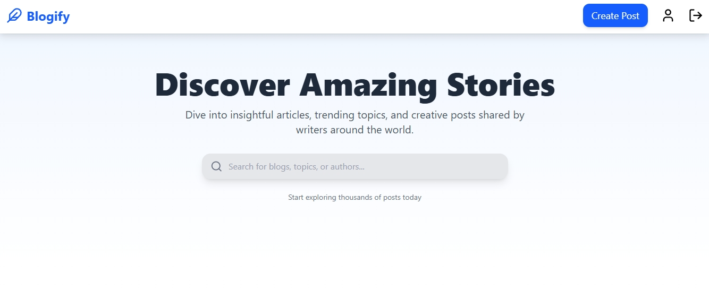
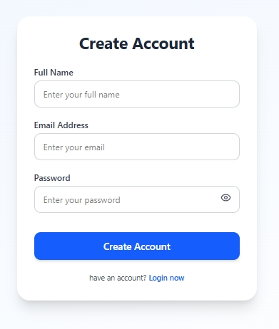
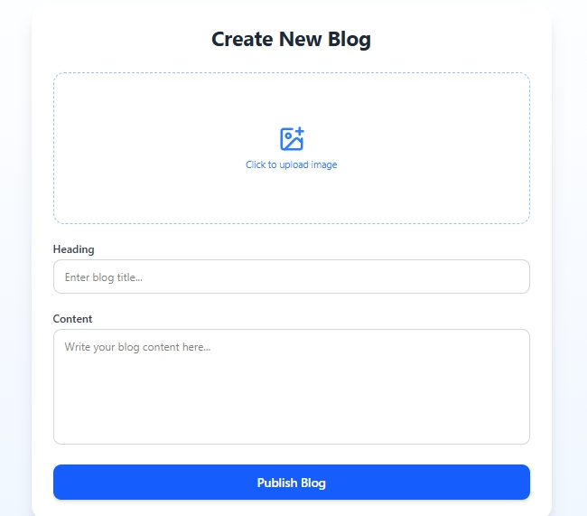

# 📝 MERN Blog Application

A full-stack Blog Application built using the MERN stack (MongoDB, Express.js, React.js, Node.js).
This project includes authentication, authorization, blog CRUD functionality, and a comment system.

---

## 🚀 Features

* 🔐 User Authentication (JWT-based login & registration)
* 🛡 Protected Routes & Authorization
* ✍️ Create, Read, Update, Delete (CRUD) Blog Posts
* 💬 Comment System on Posts
* 👤 User-specific post management
* 📱 Responsive Frontend UI
* 🌐 RESTful API Architecture

---

## 🛠 Tech Stack

### Frontend

* React.js
* Axios
* React Router DOM
* CSS / Tailwind (if used)

### Backend

* Node.js
* Express.js
* MongoDB
* Mongoose
* JWT (JSON Web Token)
* bcrypt (Password Hashing)
* dotenv

---

## 📂 Project Structure

blog-app-mern/
│
├── frontend/    → React Frontend
├── backend/     → Express + MongoDB Backend
│
├── .gitignore
└── README.md

---

## ⚙️ Installation & Setup Guide

### 1️⃣ Clone Repository

git clone https://github.com/your-username/blog-app-mern.git
cd blog-app-mern

---

### 2️⃣ Backend Setup

cd backend
npm install

Create a `.env` file inside backend folder:

PORT=5000
MONGO_URI=your_mongodb_connection_string
JWT_SECRET=your_secret_key

Start backend server:

npm start

Server will run on:
http://localhost:5000

---

### 3️⃣ Frontend Setup

Open new terminal:

cd frontend
npm install
npm start

Frontend will run on:
http://localhost:3000

---

## 🔐 Authentication Flow

* User registers
* Password is hashed using bcrypt
* JWT token is generated on login
* Token is stored in client
* Protected routes verify token using middleware

---

## 📸 Screenshots

Create a folder in root directory:

screenshots/

Add images like:

screenshots/home.png
screenshots/login.png
screenshots/create-post.png

Then they will appear below:

### 🏠 Home Page

### 🔐 Login Page

### ✍️ Create Post Page

---

## 📌 Future Improvements

* Like & Dislike system
* Image upload with Cloudinary
* Pagination
* Deployment (Render / Vercel)
* Admin dashboard

---

## 📚 Learning Outcomes

* Implemented JWT authentication
* Created RESTful APIs
* Applied role-based authorization
* Managed global state in React
* Connected frontend with backend using Axios

---

## 👨‍💻 Author

Your Name
GitHub: https://github.com/your-username

---

⭐ If you like this project, feel free to star the repository!
